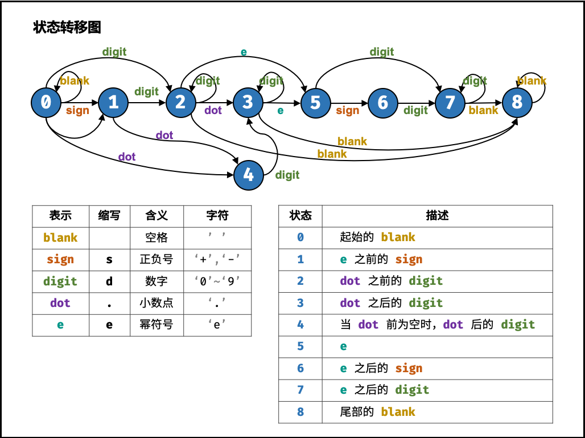

## 表示数值的字符串

- 题目链接：https://leetcode-cn.com/problems/biao-shi-shu-zhi-de-zi-fu-chuan-lcof/
- Tag：自动机，字符串

## 题目描述
请实现一个函数用来判断字符串是否表示数值（包括整数和小数）。例如，字符串"+100"、"5e2"、"-123"、"3.1416"、"0123"都表示数值，但"12e"、"1a3.14"、"1.2.3"、"+-5"、"-1E-16"及"12e+5.4"都不是。

## 解法
其中只有2，3，7，8为合法结束状态

```
class Solution {
    public boolean isNumber(String s) {
        Map[] states = {
            new HashMap<>() {{ put(' ', 0); put('s', 1); put('d', 2); put('.', 4); }}, // 0.
            new HashMap<>() {{ put('d', 2); put('.', 4); }},                           // 1.
            new HashMap<>() {{ put('d', 2); put('.', 3); put('e', 5); put(' ', 8); }}, // 2.
            new HashMap<>() {{ put('d', 3); put('e', 5); put(' ', 8); }},              // 3.
            new HashMap<>() {{ put('d', 3); }},                                        // 4.
            new HashMap<>() {{ put('s', 6); put('d', 7); }},                           // 5.
            new HashMap<>() {{ put('d', 7); }},                                        // 6.
            new HashMap<>() {{ put('d', 7); put(' ', 8); }},                           // 7.
            new HashMap<>() {{ put(' ', 8); }}                                         // 8.
        };
        int p = 0;
        char t;
        for(char c : s.toCharArray()) {
            if(c >= '0' && c <= '9') t = 'd';
            else if(c == '+' || c == '-') t = 's';
            else t = c;
            if(!states[p].containsKey(t)) return false;
            p = (int)states[p].get(t);
        }
        return p == 2 || p == 3 || p == 7 || p == 8;
    }
}
```